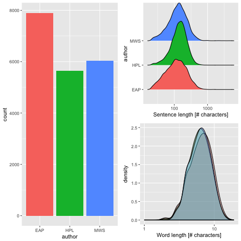
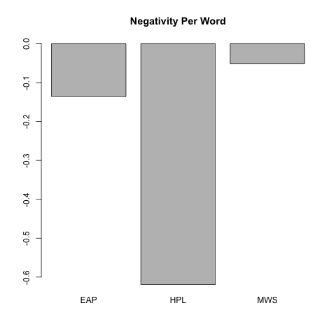
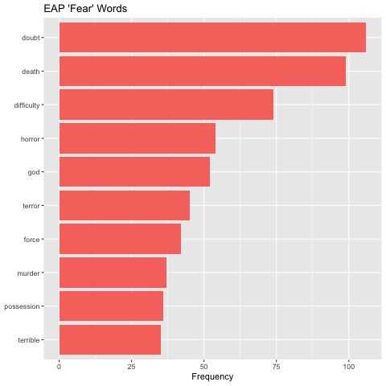
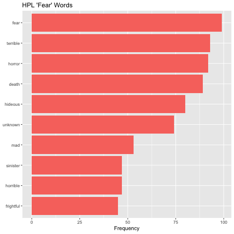
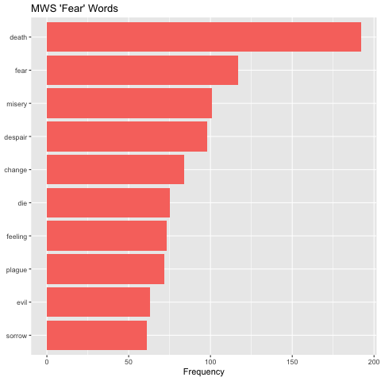

# Spring 2018
# Project 1: Spooky Data

## Project Description

Objective: To examine the novels of Edgar Allan Poe, HP Lovecraft, and Mary Shelley to compare and contrast their prose.
Name: Michael Sheng
UNI: ms4973

## Who's the Scariest of Them All?

1. Basic summary statistics between the authors:

The authors have very similar sentence length and word length distribution, with HP Lovecraft having more words and a slightly longer word length.

2. Sentiment Analysis

We first look at the negativity of each author's prose, measured by an aggregate numerical sentiment value assigned to each word averaged across the entire text.

HP Lovecraft has very negative prose compared to that of the other two.

We then look at each author's distribution of "fearful" words and examine the most common ones.

EAP:

HPL:

MWS:

The words death and fear are common to all three authors, with death being most used by MWS, EAP, and HPL. The word fear itself is used quite often by HPL and MWS but not EAP - do we have to use the word fear to generate fear?

All in all, EAP looks rather weak here, losing both on the negativity indicator and number of common fearful words. 

HPL wins with high negativity, and a fearful word distribution/count not too far from MWS.